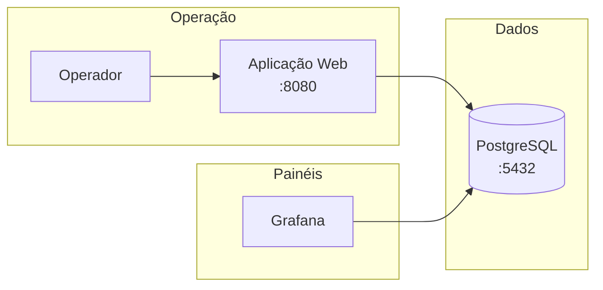

<div align="center">

# Painel de Indicadores

**CRUD web para lançamento operacional de dados · PostgreSQL · Grafana**

Interface pensada para **desktop**: formulários configuráveis, fórmulas automáticas e integração direta com painéis.

<br>

[](https://openjdk.org/)
[](https://spring.io/projects/spring-boot)
[](https://www.postgresql.org/)
[](https://docs.docker.com/compose/)

<br>

[Início rápido](#-início-rápido) ·
[Funcionalidades](#-funcionalidades) ·
[Instalação completa](#-instalação-em-outra-máquina) ·
[Grafana](#-integração-com-grafana) ·
[Problemas comuns](#-solução-de-problemas) ·
[Documentação extra](docs/)

</div>

---

## Sumário

- [Início rápido](#-início-rápido)
- [O que é este projeto](#-o-que-é-este-projeto)
- [Arquitetura](#-arquitetura)
- [Requisitos](#-requisitos)
- [Instalação em outra máquina](#-instalação-em-outra-máquina)
- [Uso no dia a dia](#-uso-no-dia-a-dia)
- [Integração com Grafana](#-integração-com-grafana)
- [Criar formulários e fórmulas](#-criar-formulários-e-fórmulas)
- [Desenvolvimento local](#-desenvolvimento-local)
- [Solução de problemas](#-solução-de-problemas)
- [Estrutura do repositório](#-estrutura-do-repositório)
- [Segurança](#-segurança)

---

## Início rápido

```powershell
git clone https://github.com/BezerraPH/WEB_CRUD---Java_SpringBoot-PostgreSQL-Docker.git
cd WEB_CRUD---Java_SpringBoot-PostgreSQL-Docker
copy .env.example .env
notepad .env
docker compose up -d --build
```

| Serviço | URL | Descrição |
|:--------|:----|:----------|
| **Aplicação** | http://localhost:8080 | Lançamento e gestão de dados |
| **Adminer** | http://localhost:8081 | Consulta SQL no navegador |

> [!IMPORTANT]
> O arquivo `.env` **não** é versionado. Defina uma senha forte em `POSTGRES_PASSWORD` antes de subir os containers.

Guia detalhado: **[docs/INSTALACAO.md](docs/INSTALACAO.md)**

---

## O que é este projeto

Sistema para **registrar indicadores operacionais** em formulários web. Os dados ficam no **PostgreSQL** e são consumidos pelo **Grafana** via SQL — sem API intermediária e sem exportar planilhas.

| Recurso | Descrição |
|:--------|:----------|
| Lançamento | Preencher formulários e gravar no banco |
| Listagem | Ver, editar e excluir registros na mesma tela |
| Construtor | Criar novos indicadores pela interface (tabela + campos) |
| Fórmulas | Cálculos automáticos com `+`, `-`, `*`, `/` por formulário |
| Grafana | Leitura direta das tabelas PostgreSQL |

> [!NOTE]
> **Regra de dados:** a chave única é `id`. Várias entradas no **mesmo dia** são permitidas (use `SUM()` no Grafana para acumular).

---

## Arquitetura



| Camada | Tecnologia |
|:-------|:-----------|
| Backend | Java 17 · Spring Boot 3 |
| Interface | Thymeleaf · Bootstrap 5 · CSS customizado |
| Banco | PostgreSQL 16 |
| Deploy | Docker Compose (app + banco + Adminer) |

Detalhes técnicos: **[docs/ARQUITETURA.md](docs/ARQUITETURA.md)**

---

## Requisitos

| Item | Observação |
|:-----|:-----------|
| **Docker Desktop** | Com Compose v2 |
| **Portas livres** | `8080` (app) · `8081` (Adminer) · `5432` (PostgreSQL) |
| **Rede** | Grafana e operadores devem alcançar o IP do servidor |

---

## Instalação em outra máquina

<details>
<summary><strong>Passo a passo completo (clique para expandir)</strong></summary>

<br>

### 1 · Obter o código

```powershell
git clone https://github.com/BezerraPH/WEB_CRUD---Java_SpringBoot-PostgreSQL-Docker.git
cd WEB_CRUD---Java_SpringBoot-PostgreSQL-Docker
```

Também é possível copiar a pasta do projeto por pendrive ou rede interna.

### 2 · Variáveis de ambiente

```powershell
copy .env.example .env
notepad .env
```

Exemplo de `.env`:

```env
POSTGRES_DB=indicadores
POSTGRES_USER=postgres
POSTGRES_PASSWORD=sua_senha_segura
POSTGRES_HOST=postgres
POSTGRES_PORT=5432
APP_PORT=8080
ADMINER_PORT=8081
```

| Ambiente | `POSTGRES_HOST` |
|:---------|:----------------|
| Docker Compose | `postgres` (nome do serviço) |
| Maven local | `localhost` |

### 3 · Subir os containers

```powershell
docker compose up -d --build
docker compose ps
```

Aguarde `postgres`, `indicadores-app` e `adminer` ficarem saudáveis.

### 4 · Validar

- App: `http://localhost:8080` (ou `http://IP_DO_SERVIDOR:8080`)
- Adminer: `http://localhost:8081`

### 5 · Adminer (primeira conexão)

| Campo | Valor |
|:------|:------|
| Sistema | PostgreSQL |
| Servidor | `postgres` |
| Usuário | `postgres` |
| Senha | valor de `POSTGRES_PASSWORD` no `.env` |
| Banco | `indicadores` |

### 6 · Grafana (servidor separado)

Crie uma fonte de dados **PostgreSQL**:

| Campo | Valor |
|:------|:------|
| Host | IP da máquina Docker |
| Port | `5432` |
| Database | `indicadores` |
| User / Password | `postgres` / senha do `.env` |
| SSL | Desligado (rede interna) |

Teste: `SELECT COUNT(*) FROM dados_indicadores;`

### 7 · Compartilhar com a equipe

Envie `http://IP:8080` apenas para pessoas autorizadas. **Não há tela de login.**

</details>

---

## Uso no dia a dia

### Tela inicial

| Ação | Caminho |
|:-----|:--------|
| Ver todos os formulários | `/formularios` |
| Criar novo indicador | `/formularios/novo` |

### Lançar dados

1. Escolha o formulário (ex.: SISGCORP, PCE).
2. Acesse `/m/{slug}` — ex.: `/m/dados_indicadores`.
3. Preencha os campos e clique em **Gravar lançamento**.
4. O registro aparece na tabela (layout lado a lado em telas largas).

### Editar ou excluir

Na tabela de registros: **Editar** carrega o formulário; **Excluir** pede confirmação.

### Gerenciar formulários

Em `/formularios`, cada item oferece:

| Botão | Função |
|:------|:-------|
| **Preencher** | Lançar dados |
| **Fórmulas** | Configurar cálculos automáticos |
| **Editar** | Título, descrição e novos campos |
| **Excluir** | Remove formulário e tabela (irreversível) |

### Atalhos de URL

| URL | Função |
|:----|:-------|
| `/` | Início |
| `/formularios` | Lista de formulários |
| `/formularios/novo` | Construtor |
| `/m/dados_indicadores` | Indicadores SISGCORP |
| `/m/pce_controle_destruicao` | Controle PCE para destruição |
| `/formularios/calculos/{slug}` | Editor de fórmulas |

Rotas antigas (`/admin/...`, `/painel`) redirecionam automaticamente.

---

## Integração com Grafana

O Grafana consulta **diretamente** as tabelas do banco `indicadores`.

### Exemplos de SQL

**Último registro SISGCORP**

```sql
SELECT *
FROM dados_indicadores
ORDER BY data_coleta DESC, id DESC
LIMIT 1;
```

**Soma de armas recebidas (PCE) no período**

```sql
SELECT SUM(pcerec_armas) AS total_armas
FROM pce_controle_destruicao
WHERE infog_data BETWEEN '2026-01-01' AND '2026-12-31';
```

**Último saldo de armas (PCE)**

```sql
SELECT saldoatualdearmas
FROM pce_controle_destruicao
ORDER BY infog_data DESC, id DESC
LIMIT 1;
```

### Campo Nº TRAM (PCE)

| Na tela | No banco |
|:--------|:---------|
| **Nº TRAM** | `infog_nrtram` |

---

## Criar formulários e fórmulas

### Novo indicador (sem código)

1. **Criar formulário novo** em `/formularios/novo`.
2. Informe título e, opcionalmente, slug e nome da tabela.
3. Adicione campos:
   - **Data** — pelo menos um (ordenação e Grafana).
   - **Número** — valores quantitativos.
   - **Texto** — observações curtas.
4. Confirme a criação.

O sistema cria a tabela no PostgreSQL, registra metadados e libera `/m/{slug}`.

Para **novos campos depois**: `/formularios/{slug}/editar`.

### Fórmulas automáticas

Qualquer formulário pode ter regras em **Fórmulas** (`/formularios/calculos/{slug}`):

- Operadores: `+`, `-`, `*`, `/` e parênteses.
- Referência por **nome do campo** (ex.: `pcerec_armas + saldoanosanteriorarmas`).
- Ative ou desative cálculos e regras individuais.

Formulários iniciais vêm de `indicadores-crud/src/main/resources/modulos.yml` e são importados ao banco na primeira subida. Depois, tudo é gerido pela interface.

> [!TIP]
> No módulo **PCE**, use **Restaurar fórmulas padrão PCE** para voltar aos saldos calculados originais.

---

## Desenvolvimento local

Pré-requisito: PostgreSQL acessível (container ou instalado).

```powershell
cd indicadores-crud
$env:POSTGRES_HOST="localhost"
$env:POSTGRES_PORT="5432"
$env:POSTGRES_DB="indicadores"
$env:POSTGRES_USER="postgres"
$env:POSTGRES_PASSWORD="sua_senha"
mvn spring-boot:run
```

Acesse http://localhost:8080

---

## Solução de problemas

<details>
<summary><strong>Ver logs da aplicação</strong></summary>

```powershell
docker compose logs -f indicadores-app
```

</details>

<details>
<summary><strong>Reiniciar só a aplicação</strong></summary>

```powershell
docker compose restart indicadores-app
```

</details>

<details>
<summary><strong>Reset completo do banco (apaga todos os dados)</strong></summary>

```powershell
docker compose down -v
docker compose up -d --build
```

Recria tabelas a partir de `sql/schema.sql`. Formulários criados pela interface serão perdidos.

</details>

<details>
<summary><strong>Erro: <code>formulario_def</code> não existe</strong></summary>

Na primeira subida, o app executa os scripts em `indicadores-crud/src/main/resources/db/`. Se persistir, verifique logs e permissões do usuário `postgres`.

</details>

<details>
<summary><strong>Porta 8080 em uso</strong></summary>

Altere `APP_PORT` no `.env` (ex.: `8082`) e execute `docker compose up -d` novamente.

</details>

<details>
<summary><strong><code>password authentication failed for user "postgres"</code></strong></summary>

A senha no `.env` não coincide com a gravada no **volume** do PostgreSQL (criado na primeira subida).

**Opção A — alinhar senha sem apagar dados** (substitua pela senha do seu `.env`):

```powershell
docker exec indicadores-postgres psql -U postgres -c "ALTER USER postgres WITH PASSWORD 'sua_senha_segura';"
docker restart indicadores-crud
```

**Opção B — recriar tudo do zero**

```powershell
docker compose down -v
docker compose up -d --build
```

Confirme a conexão no Adminer antes de reiniciar a app.

</details>

---

## Estrutura do repositório

```
.
├── docker-compose.yml          # PostgreSQL + app + Adminer
├── .env.example                # Modelo (copiar para .env)
├── sql/
│   └── schema.sql              # Tabelas iniciais (SISGCORP, PCE)
├── docs/
│   ├── INSTALACAO.md           # Clone e Docker
│   └── ARQUITETURA.md          # Visão técnica
└── indicadores-crud/           # Aplicação Spring Boot
    ├── Dockerfile
    ├── pom.xml
    └── src/main/
        ├── java/               # Controllers, services, config
        └── resources/
            ├── modulos.yml     # Formulários iniciais
            ├── templates/      # Thymeleaf (HTML)
            └── static/         # CSS e JS
```

---

## Segurança

> [!WARNING]
> A aplicação **não possui autenticação**. Restrinja o acesso por firewall/VLAN e não exponha as portas na internet sem necessidade.

| Prática | Motivo |
|:--------|:-------|
| Senha forte em `POSTGRES_PASSWORD` | Protege o banco |
| Não commitar `.env` | Evita vazamento de credenciais |
| Não expor `5432` publicamente | Acesso direto ao PostgreSQL |
| Repositório privado no GitHub | Dados operacionais sensíveis |

---

<div align="center">

**PostgreSQL · Grafana · Uso restrito à rede autorizada**

[⬆ Voltar ao topo](#painel-de-indicadores)

</div>
