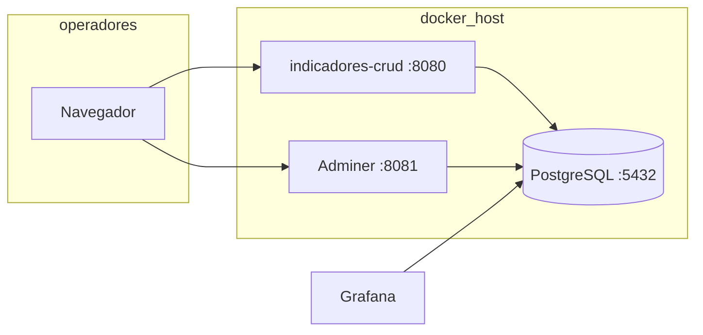

# Arquitetura — CRUD de Indicadores

## Visão geral

## Camadas da aplicação

| Camada | Pacote / pasta | Responsabilidade |
|--------|----------------|------------------|
| Web | `web.*` | Rotas HTTP, Thymeleaf, redirects |
| Serviço | `service.*` | CRUD, construtor de formulários, PCE |
| Config | `config.*` | YAML, metadados, migration startup |
| Util | `util.*` | Slugs e nomes SQL seguros |

## Fluxo de um lançamento

1. `ModuloController` resolve o módulo via `ModuloRegistry` (YAML + banco).  
2. `ModuloCrudService` converte parâmetros do formulário.  
3. Se `processador = pce`, `PceProcessador` calcula saldos.  
4. `ModuloRepository` executa `INSERT` ou `UPDATE` na tabela física.

## Dois tipos de formulário

| Tipo | Origem | Tabela | Alteração pela UI |
|------|--------|--------|-------------------|
| Sistema | `modulos.yml` | Definida no schema/YAML | Não (só código) |
| Personalizado | Construtor web | Criada em runtime | Sim (editar campos / excluir) |

Metadados dos personalizados:

- `formulario_def` — slug, título, tabela, coluna de ordenação  
- `formulario_grupo` — agrupamento na tela  
- `formulario_campo` — campos do formulário  
- `formulario_listagem` — colunas da tabela de registros  

`ModuloRegistry` mescla ambos na subida e após cada alteração no construtor.

## Inicialização do banco

1. **Docker (primeira vez):** `sql/schema.sql` via `docker-entrypoint-initdb.d`.  
2. **App (se necessário):** `DatabaseSchemaRunner` aplica `db/02-formularios-meta.sql` se `formulario_def` não existir.

## Interface (desktop)

- **≥ 1024px:** menu lateral fixo; em `/m/{slug}` formulário à esquerda e tabela à direita (`desktop-split`).  
- **&lt; 1024px:** layout em coluna única; menu lateral oculto (navegação pelo cabeçalho).

Atributos globais Thymeleaf: `GlobalModelAdvice` (`menuModulos`, `showSidebar`, `showNavFormularios`).

## Extensibilidade

| Necessidade | Abordagem |
|-------------|-----------|
| Novo indicador simples | Construtor em `/formularios/novo` |
| Cálculos customizados | Novo `@Component` processador + `modulos.yml` |
| Colunas fixas legadas | `sql/schema.sql` + entrada em `modulos.yml` |
